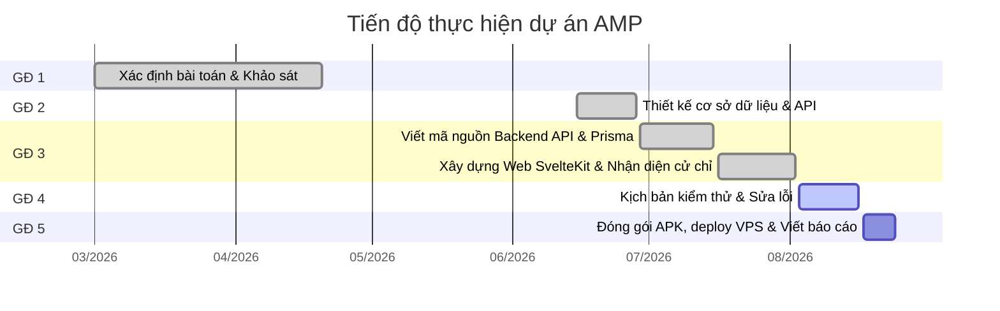
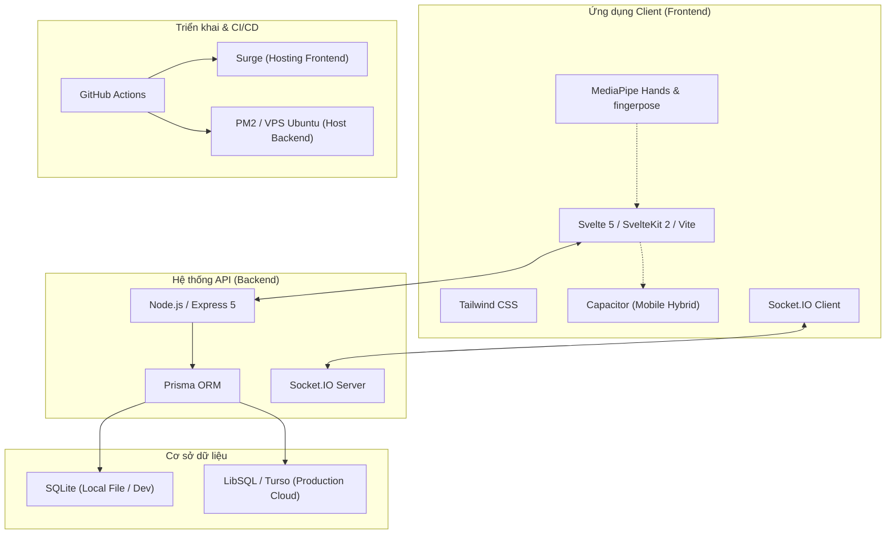
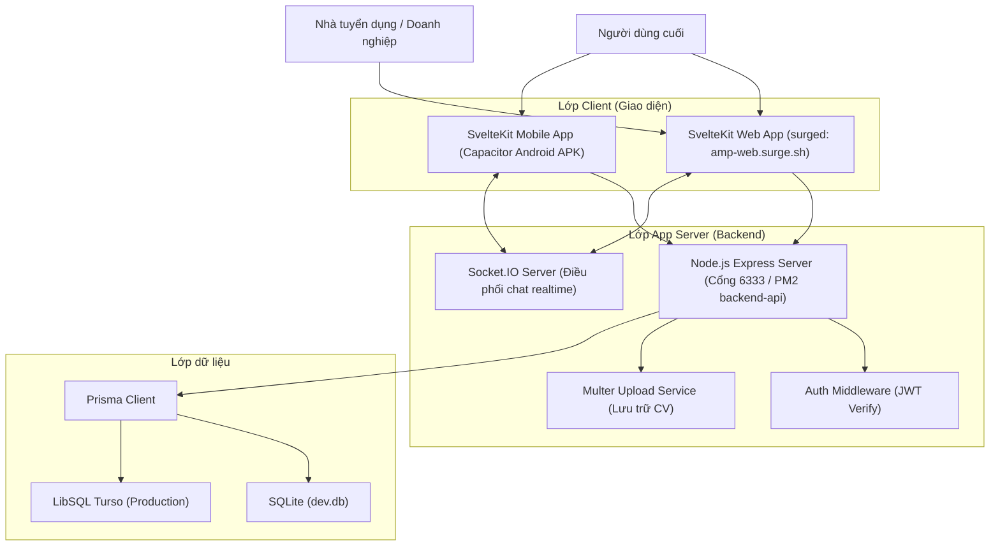
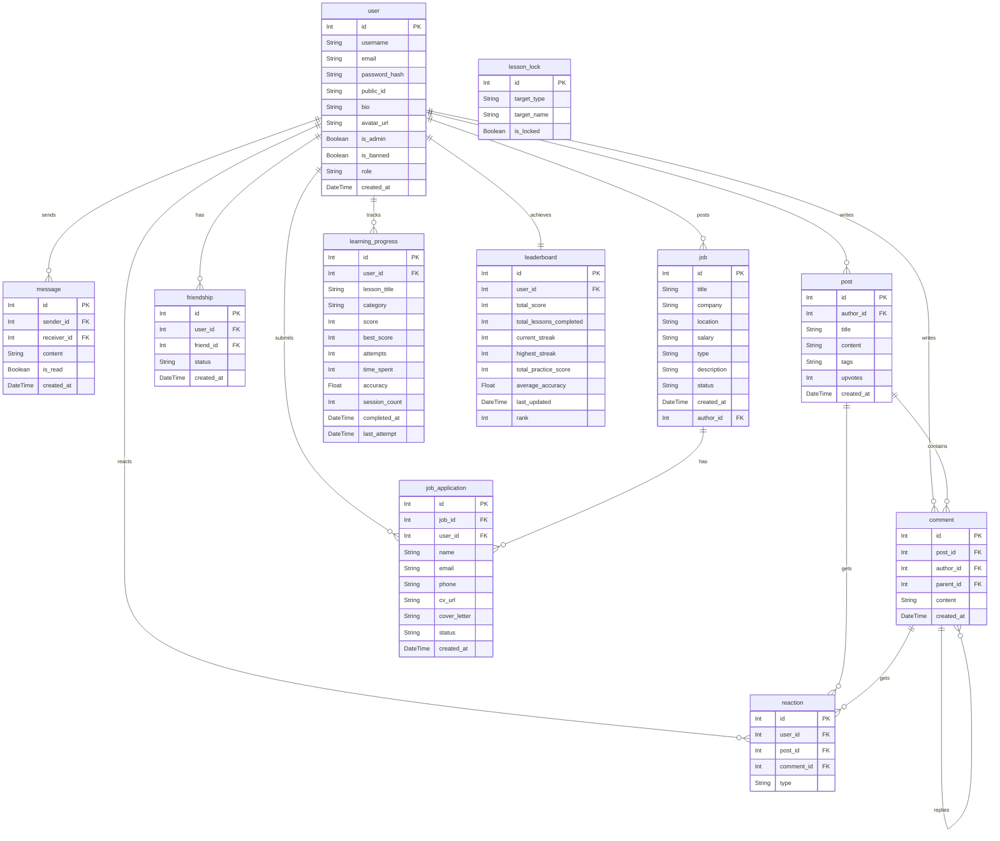
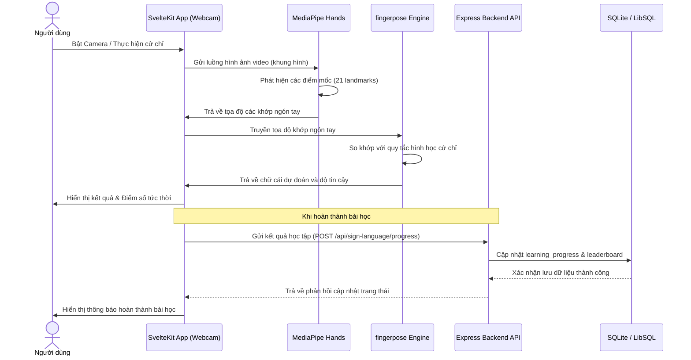
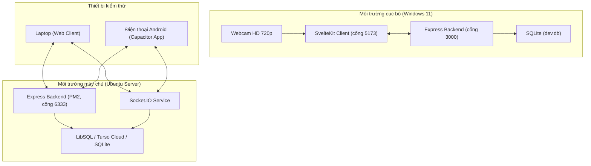
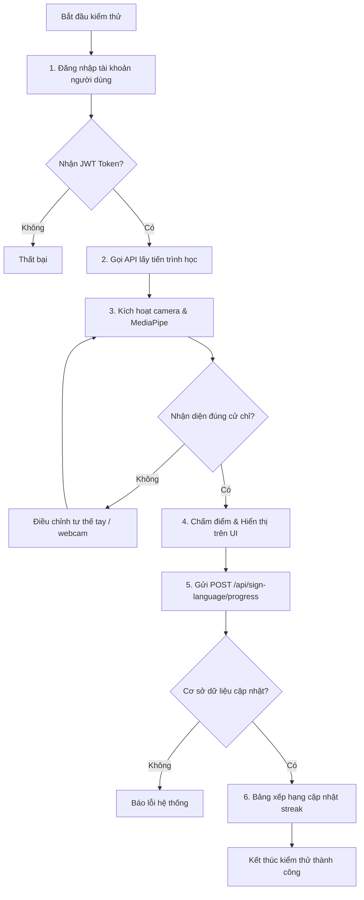
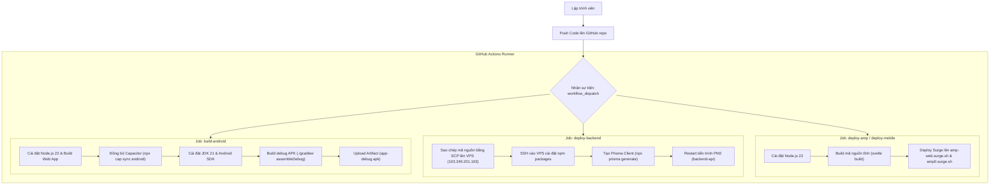
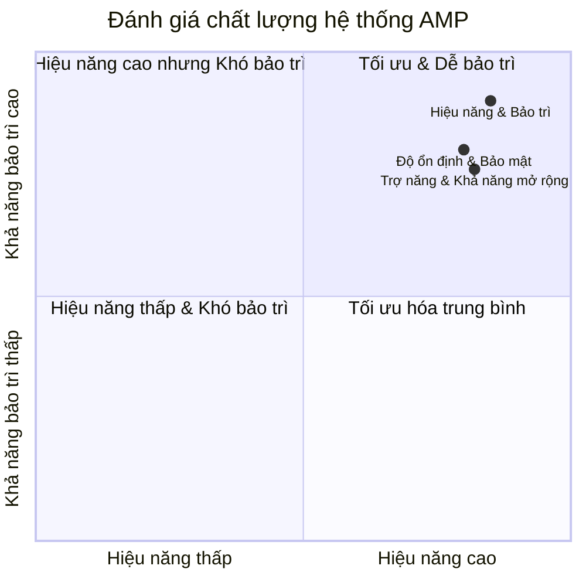

# 5. NỘI DUNG THỰC HIỆN

## 5.1 Quá trình thực hiện giải pháp

### 5.1.1 Khảo sát và phân tích bài toán

Phạm vi của dự án được giới hạn trong việc xây dựng hệ thống AMP gồm phiên bản Web và ứng dụng di động (Android) tập trung vào các nhóm tính năng cốt lõi: học ngôn ngữ ký hiệu qua camera, diễn đàn trao đổi, hệ thống tin tuyển dụng và nộp CV trực tuyến, bộ công cụ trợ năng cơ bản (chuyển văn bản thành giọng nói). Đối tượng sử dụng chính bao gồm người khiếm thính, người khiếm khuyết vận động, nhà tuyển dụng và cộng đồng người dùng muốn chia sẻ kiến thức.

Dưới đây là bảng tổng hợp các yêu cầu chức năng và phi chức năng của hệ thống AMP:

| Nhóm yêu cầu | Mã yêu cầu | Tên yêu cầu | Mô tả chi tiết |
| :--- | :--- | :--- | :--- |
| **Yêu cầu chức năng** | YCCN-01 | Đăng ký & Đăng nhập | Cho phép người dùng và nhà tuyển dụng tạo tài khoản, đăng nhập hệ thống bảo mật bằng mã hóa mật khẩu và token JWT. |
| | YCCN-02 | Học ngôn ngữ ký hiệu | Nhận diện cử chỉ tay thông qua webcam thời gian thực, chấm điểm và lưu trữ tiến trình học tập của người dùng. |
| | YCCN-03 | Quản lý bảng xếp hạng | Cập nhật điểm số, tính toán chuỗi ngày học liên tục (streak) và xếp hạng học tập tự động. |
| | YCCN-04 | Diễn đàn cộng đồng | Đăng tải bài viết, bình luận (hỗ trợ nhiều cấp), bình chọn bài viết (upvote) và phân loại theo tag. |
| | YCCN-05 | Nhắn tin thời gian thực | Nhắn tin trực tiếp giữa các người dùng thông qua kết nối Socket.IO. |
| | YCCN-06 | Tuyển dụng & Nộp hồ sơ | Nhà tuyển dụng đăng tin tuyển dụng; người tìm việc tạo và tải hồ sơ CV dạng file lên hệ thống. |
| | YCCN-07 | Trợ năng âm thanh (TTS) | Chuyển đổi văn bản tiếng Việt thành giọng nói và phát trực tiếp trên giao diện người dùng. |
| **Yêu cầu phi chức năng** | YCPN-01 | Độ trễ nhận diện | Thời gian phản hồi nhận diện cử chỉ tay dưới 150ms trên cấu hình máy tính thông thường. |
| | YCPN-02 | Tính an toàn bảo mật | Mật khẩu được băm bằng thuật toán bcryptjs; thông tin truyền tải qua API được xác thực bằng mã Token JWT. |
| | YCPN-03 | Tính tương thích | Hoạt động ổn định trên các trình duyệt phổ biến (Chrome, Edge, Safari) và các thiết bị Android từ phiên bản 8.0 trở lên. |
| | YCPN-04 | Khả năng mở rộng | Cấu trúc cơ sở dữ liệu hỗ trợ tốt việc mở rộng thêm các bài học cử chỉ mới và tăng lượng truy cập đồng thời. |

### 5.1.2 Lập kế hoạch thực hiện

### 5.1.3 Lựa chọn công nghệ và công cụ

| Hạng mục | Công nghệ / Công cụ | Vai trò trong hệ thống | Lý do lựa chọn |
| :--- | :--- | :--- | :--- |
| **Backend Framework** | Node.js, Express (v5.2.1) | Xây dựng API và xử lý logic nghiệp vụ phía máy chủ. | Express nhẹ, xử lý bất đồng bộ tốt, phù hợp cho các ứng dụng có lượng I/O lớn như chat và thông báo. |
| **Database & ORM** | SQLite, Prisma ORM (v5.22.0), LibSQL | Lưu trữ dữ liệu hệ thống; Prisma đóng vai trò ánh xạ cơ sở dữ liệu quan hệ sang mã nguồn. | Prisma hỗ trợ kiểm tra kiểu dữ liệu mạnh mẽ, giúp tối ưu truy vấn. SQLite kết hợp LibSQL (Turso) giúp triển khai nhanh và dễ cấu hình. |
| **Frontend Web** | Svelte 5, SvelteKit 2, Vite | Phát triển giao diện người dùng ứng dụng Web. | Svelte biên dịch trực tiếp ra mã vanilla JS giúp ứng dụng chạy cực nhẹ, tối ưu tài nguyên cho các tác vụ nhận diện bằng camera. |
| **Mobile Client** | Capacitor (v8.4.2) | Đóng gói ứng dụng SvelteKit thành ứng dụng di động Android gốc. | Capacitor hỗ trợ tái sử dụng mã nguồn web hiệu quả, truy cập các API phần cứng như camera dễ dàng. |
| **Nhận diện cử chỉ** | Google MediaPipe Hands, fingerpose | Phát hiện các điểm mốc trên bàn tay và phân loại cử chỉ ký hiệu chữ cái từ luồng camera. | MediaPipe xử lý ảnh trực tiếp trên trình duyệt bằng WebGL, giảm tải hoàn toàn cho máy chủ; fingerpose hỗ trợ định nghĩa cử chỉ bằng các quy tắc hình học đơn giản. |
| **Kết nối thời gian thực** | Socket.IO (v4.8.3) | Truyền tải tin nhắn trực tiếp giữa các người dùng. | Hỗ trợ kết nối song song liên tục với cơ chế fallback tự động, đảm bảo tin nhắn được truyền đi ngay lập tức. |
| **Triển khai hạ tầng** | GitHub Actions, PM2, Surge (v0.34.0) | Tự động hóa quy trình xây dựng, triển khai và quản lý dịch vụ trên máy chủ. | GitHub Actions giúp tự động kiểm tra và build APK; PM2 quản lý tiến trình backend chạy liên tục trên VPS; Surge hỗ trợ hosting tĩnh tốc độ cao cho frontend. |

Dưới đây là sơ đồ minh họa hệ sinh thái công nghệ được áp dụng trong dự án AMP.

Sơ đồ 5.3: Sơ đồ tổng quan công nghệ sử dụng trong hệ thống

Quy trình chuẩn bị và thống nhất các quyết định nền tảng nêu trên đã tạo cơ sở vững chắc để nhóm dự án bước vào giai đoạn thiết kế chi tiết kiến trúc phần mềm và cơ sở dữ liệu được trình bày ở mục tiếp theo.

---

## 5.2 Thiết kế và xây dựng hệ thống

Mục này trình bày chi tiết kiến trúc tổng thể của hệ thống, thiết kế cơ sở dữ liệu quan hệ vật lý, danh sách các giao tiếp lập trình ứng dụng (API), luồng xử lý nhận dạng cử chỉ bằng trí tuệ nhân tạo và các biện pháp bảo mật dữ liệu được cài đặt trong mã nguồn thực tế.

### 5.2.1 Thiết kế hệ thống

Dưới đây là sơ đồ kiến trúc luồng dữ liệu tổng thể giữa Client và Server của hệ thống AMP.

Hệ thống sử dụng cơ sở dữ liệu SQLite/LibSQL bao gồm 11 bảng dữ liệu quan hệ được liên kết chặt chẽ với nhau:

Thiết kế giao tiếp lập trình API của hệ thống được xây dựng theo chuẩn RESTful cho các tài nguyên nghiệp vụ chính.

Hệ thống AMP áp dụng các giải pháp bảo mật nhiều lớp từ mã nguồn:

1. **Xác thực và phân quyền:** Sử dụng Middleware để giải mã mã Token JWT được gửi kèm ở tiêu đề (Header) của mỗi yêu cầu HTTP. Chỉ những yêu cầu hợp lệ mới được truy cập tài nguyên bảo mật.
2. **Mã hóa dữ liệu nhạy cảm:** Mật khẩu của người dùng được băm một chiều bằng thuật toán `bcryptjs` với độ muối (salt rounds) là 10 trước khi ghi nhận vào cơ sở dữ liệu thông qua Prisma.
3. **An toàn kết nối:** Kích hoạt chính sách CORS để giới hạn quyền truy cập tài nguyên API, chỉ cho phép các cổng cục bộ và các tên miền cấu hình trước kết nối đến máy chủ.

Các thiết kế hệ thống và mô hình dữ liệu này đã được nhóm dự án hiện thực hóa thành mã nguồn hoạt động. Quy trình kiểm thử thực tế để đánh giá tính đúng đắn của các chức năng được tiếp tục mô tả trong mục 5.3.

---

## 5.3 Thử nghiệm thực tế

Mục này mô tả các môi trường phần cứng và phần mềm được sử dụng để tiến hành thử nghiệm, đồng thời liệt kê các kịch bản kiểm thử (Test Cases) chi tiết đối với các tính năng quan trọng nhất của hệ thống AMP.

### 5.3.1 Môi trường thử nghiệm

Quá trình thử nghiệm kiểm thử chức năng và hiệu năng nhận diện hình ảnh cử chỉ được tiến hành song song trên cả hai môi trường:

- **Môi trường máy phát triển cục bộ (Local Development):**
  - Hệ điều hành: Windows 11 Pro.
  - Máy chủ Backend: Node.js v22.11.0, chạy cổng `6333` (được cấu hình trong `server.js`).
  - Giao diện Frontend: SvelteKit chạy trên máy chủ Vite, cổng `5173`.
  - Cơ sở dữ liệu: SQLite cục bộ tệp `prisma/dev.db`.
  - Thiết bị camera: Webcam tích hợp độ phân giải HD 720p.
- **Môi trường máy chủ thử nghiệm (Staging Environment):**
  - Hệ điều hành máy chủ: Ubuntu Server 22.04 LTS (địa chỉ IP `103.249.201.193`).
  - Quản lý tiến trình backend: PM2.
  - Cơ sở dữ liệu: SQLite tích hợp Prisma Client.
  - Thiết bị kiểm thử phía client: Máy tính xách tay cấu hình Core i5, webcam ngoài và điện thoại di động chạy Android 13.

Dưới đây là sơ đồ bố trí mạng và liên kết giữa các thiết bị kiểm thử với hệ thống máy chủ thử nghiệm.

Sơ đồ 5.7: Sơ đồ bố trí môi trường thử nghiệm thực tế

### 5.3.2 Quy trình thử nghiệm

Nhóm dự án tiến hành thử nghiệm các tính năng cốt lõi bằng cách thiết lập các kịch bản kiểm thử chi tiết. Các dữ liệu kiểm thử được nhập từ thực tế để đánh giá phản hồi của hệ thống. Dưới đây là bảng đặc tả các kịch bản kiểm thử chính:

| Mã TC | Mục tiêu kiểm thử | Dữ liệu đầu vào | Các bước thực hiện | Kết quả mong đợi | Kết quả thực tế |
| :--- | :--- | :--- | :--- | :--- | :--- |
| **TC-01** | Kiểm tra nhận dạng cử chỉ chữ cái "A" | Luồng video từ webcam, tay người dùng tạo thế nắm đấm (chữ A). | 1. Truy cập trang Học ngôn ngữ ký hiệu. 2. Bật camera. 3. Đặt bàn tay trước camera mô phỏng chữ cái A. | Hệ thống hiển thị các điểm mốc xương bàn tay, nhận diện chính xác chữ "A" và cộng điểm tiến trình. | Đạt. Hệ thống nhận diện chữ "A" với độ ổn định khung hình cao sau 8 khung hình. |
| **TC-02** | Đăng tin tuyển dụng và nộp hồ sơ CV | Dữ liệu mô tả công việc, tệp tin CV định dạng PDF. | 1. Đăng nhập tài khoản nhà tuyển dụng. 2. Tạo tin tuyển dụng mới. 3. Đăng nhập tài khoản ứng viên. 4. Tìm tin tuyển dụng và tải file PDF để ứng tuyển. | Tin tuyển dụng được tạo ở trạng thái chờ duyệt. Ứng viên tải CV lên thành công và file được lưu vào thư mục `uploads`. | Đạt. File CV được lưu trữ đúng cấu trúc và bản ghi ứng tuyển được ghi nhận trong database. |
| **TC-03** | Nhắn tin trực tiếp thời gian thực | Chuỗi ký tự tin nhắn chat từ hai tài khoản người dùng khác nhau. | 1. Đăng nhập tài khoản User A và User B trên hai thiết bị. 2. User A gửi tin nhắn cho User B. 3. Kiểm tra hiển thị tại User B. | Tin nhắn xuất hiện tức thời trên màn hình User B mà không cần tải lại trang. Bản ghi được lưu vào bảng `message`. | Đạt. Socket.IO truyền tải tin nhắn tức thì, độ trễ truyền nhận nhỏ hơn 50ms. |

Dưới đây là sơ đồ mô tả luồng kiểm thử tự động quy trình đăng nhập và lưu tiến trình học tập của người dùng.

Sơ đồ 5.8: Sơ đồ quy trình thực hiện kiểm thử chức năng hệ thống

Các kịch bản kiểm thử đều cho kết quả khớp với mong đợi thiết kế ban đầu. Hệ thống hoạt động ổn định và sẵn sàng cho các công đoạn đóng gói, triển khai chính thức lên internet được mô tả chi tiết ở mục 5.4.

---

## 5.4 Triển khai và hoàn thiện sản phẩm

Mục này trình bày chi tiết quy trình tự động hóa tích hợp và triển khai liên tục (CI/CD) được thiết lập bằng công cụ GitHub Actions để đưa các cấu phần hệ thống AMP lên các máy chủ internet.

### 5.4.1 Quy trình triển khai

Quy trình triển khai của hệ thống AMP được tự động hóa hoàn toàn thông qua ba tệp quy trình hoạt động (workflow) của GitHub Actions:

1. **Triển khai ứng dụng Web lên Surge ([deploy-surge.yml](file:///D:/Project/AMPV2/.github/workflows/deploy-surge.yml)):**
   - Kích hoạt khi có yêu cầu thủ công (workflow_dispatch).
   - Tiến hành build dự án web client (`source/frontend/amp`) bằng Node 22, xuất kết quả ra thư mục tĩnh `./build` thông qua `@sveltejs/adapter-static`.
   - Sử dụng công cụ Surge để tải thư mục build lên địa chỉ hosting chính thức: `amp-web.surge.sh`.
   - Tương tự, ứng dụng web di động (`source/frontend/mobile`) cũng được build và deploy lên địa chỉ `amp0.surge.sh`.
2. **Triển khai máy chủ API Backend lên VPS Ubuntu ([deploy-backend.yml](file:///D:/Project/AMPV2/.github/workflows/deploy-backend.yml)):**
   - Sử dụng hành động SCP (`appleboy/scp-action`) sao chép toàn bộ mã nguồn backend từ thư mục `source/backend/*` lên thư mục làm việc `/var/www/AMPV2` trên VPS IP `103.249.201.193`.
   - Sử dụng kết nối SSH (`appleboy/ssh-action`) truy cập máy chủ thực thi lệnh cài đặt thư viện (`npm install`), tạo tệp Prisma Client (`npx prisma generate`), và khởi động lại dịch vụ thông qua PM2 với tên tiến trình `backend-api` chạy trên cổng 3000.
3. **Đóng gói ứng dụng di động Android ([build-apk.yml](file:///D:/Project/AMPV2/.github/workflows/build-apk.yml)):**
   - Thiết lập môi trường chạy Node.js v22 để cài đặt thư viện và build bản đóng gói tĩnh của dự án mobile.
   - Chạy lệnh `npx cap sync android` để đồng bộ toàn bộ tài nguyên web đã build vào thư mục gốc của dự án Android gốc (sử dụng thư viện Capacitor).
   - Thiết lập môi trường Java JDK 21 (Temurin) và cấu hình Android SDK trên máy ảo của GitHub.
   - Di chuyển vào thư mục dự án Android, thực thi tệp lệnh Gradle `./gradlew assembleDebug` để biên dịch ra tệp tin cài đặt ứng dụng Android gỡ lỗi `app-debug.apk`. Tệp tin sau đó được tải lên lưu trữ làm sản phẩm đầu ra (Artifact).

Dưới đây là sơ đồ mô tả toàn bộ quy trình CI/CD tích hợp và triển khai của hệ thống AMP.

Sơ đồ 5.9: Sơ đồ quy trình tự động hóa triển khai CI/CD hệ thống AMP

Sản phẩm sau khi triển khai hoạt động ổn định trên môi trường internet thực tế. Mục tiếp theo sẽ đối chiếu kết quả đạt được với các mục tiêu nghiên cứu thiết kế ban đầu để đưa ra các nhận định đánh giá khách quan.

---

## 5.5 Đánh giá mức độ hoàn thành giải pháp

### 5.5.2 Đánh giá chất lượng

Sơ đồ 5.10: Đánh giá chất lượng hệ thống AMP theo đa tiêu chí

### 5.5.3 Ưu điểm và hạn chế

Dưới đây là bảng tổng hợp các ưu điểm nổi bật cùng các mặt hạn chế còn tồn tại của hệ thống AMP kèm theo nguyên nhân cụ thể:

| Phân loại | Nội dung đánh giá | Mô tả chi tiết | Nguyên nhân kỹ thuật / Ràng buộc |
| :--- | :--- | :--- | :--- |
| **Ưu điểm** | Xử lý AI tối ưu | Nhận diện cử chỉ tay mượt mà, không yêu cầu thiết bị phần cứng chuyên dụng hay máy chủ GPU đắt tiền. | Sử dụng MediaPipe Hands chạy trực tiếp trên GPU client thông qua WebGL. |
| | Đa nền tảng thực tế | Hỗ trợ cả giao diện Web và ứng dụng di động cài đặt trực tiếp trên điện thoại Android. | Sử dụng SvelteKit làm lõi ứng dụng kết hợp với bộ đóng gói Capacitor. |
| | Kiến trúc mã nguồn sạch | Cơ sở dữ liệu đồng bộ tốt với mã nguồn phát triển, dễ nâng cấp. | Tận dụng thế mạnh ánh xạ dữ liệu của Prisma ORM và kiến trúc chia module của Express. |
| **Hạn chế** | Giới hạn nhận diện cử chỉ | Hệ thống chỉ mới nhận diện tốt các ký hiệu chữ cái tĩnh đơn lẻ (bảng chữ cái), chưa nhận diện được các từ ghép phức tạp có yếu tố chuyển động động. | Thư viện fingerpose chỉ hỗ trợ cấu hình cử chỉ dựa trên góc gập của từng ngón tay đơn lẻ, chưa hỗ trợ chuỗi chuyển động thời gian. |
| | Giới hạn cơ sở dữ liệu | Khả năng đáp ứng tải đồng thời cực lớn ở mức trung bình. | Hệ thống đang sử dụng cơ sở dữ liệu dạng tệp tin SQLite cục bộ để đơn giản hóa quá trình vận hành. |

### 5.5.4 Hướng phát triển

Để giải quyết các hạn chế nêu trên và nâng cao giá trị thực tiễn của sản phẩm, nhóm dự án vạch ra lộ trình phát triển hệ thống AMP trong tương lai tập trung vào ba hướng chính:

1. **Nâng cấp công nghệ nhận diện cử chỉ:** Tích hợp mô hình học sâu Custom LSTM hoặc sử dụng MediaPipe Pose kết hợp với TensorFlow.js để nhận diện các từ cử chỉ động phức tạp và các câu ngôn ngữ ký hiệu hoàn chỉnh có yếu tố di chuyển của cánh tay và cơ thể.
2. **Mở rộng cơ sở dữ liệu:** Chuyển đổi từ SQLite sang cơ sở dữ liệu phân tán hoặc hệ quản trị cơ sở dữ liệu PostgreSQL chạy trên môi trường Docker để nâng cao khả năng ghi nhận dữ liệu đồng thời, đáp ứng nhu cầu tăng trưởng thành viên của cộng đồng.
3. **Phát triển tính năng học tập thông minh:** Xây dựng hệ thống bài học cá nhân hóa dựa trên AI, tự động phát hiện các ký hiệu người dùng hay thực hiện sai để đưa ra bài tập ôn luyện phù hợp.

