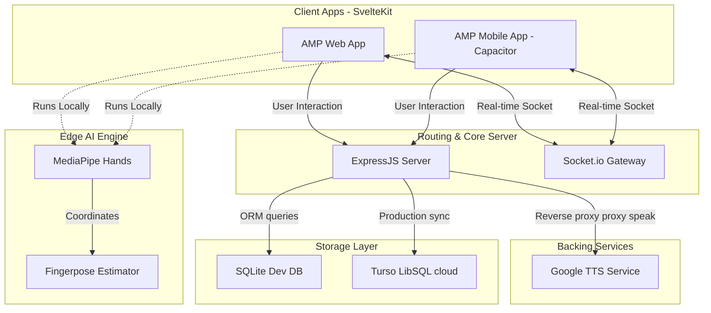

# 02. System Architecture

Hệ thống AMP áp dụng mô hình phân tầng Client-Server hỗ trợ các luồng xử lý thời gian thực và tương tác trí tuệ nhân tạo biên (Edge AI) chạy trực tiếp trên thiết bị khách.

## Sơ đồ Kiến trúc Tổng quát

## Chi tiết các Layer

### 1. Client App (Frontend)
- Được phát triển bằng **SvelteKit** chia làm hai Workspace:
  - `amp`: Bản web deploy lên Surge.
  - `mobile`: Bản mobile tích hợp **Capacitor** để biên dịch trực tiếp sang ứng dụng Android.
- Tích hợp các SDK phía client như Google One Tap Sign-In, Recaptcha và Socket.io Client.

### 2. Edge AI Layer
- Xử lý nhận dạng ngôn ngữ ký hiệu (Sign Language Recognition) chạy hoàn toàn trên trình duyệt của Client để đảm bảo tốc độ phản hồi tức thời mà không gây tải cho máy chủ.
- **MediaPipe Hands** định vị 21 điểm mốc xương bàn tay (landmarks) từ luồng Camera trực tiếp.
- **Fingerpose** tính toán góc nghiêng của các ngón tay và đối sánh với bộ định nghĩa cử chỉ (`gestures.js`) để trả về ký tự tương ứng (A-Z, 0-9).

### 3. API Gateway & Core Backend
- **Express.js** làm HTTP RESTful API Server chịu trách nhiệm định tuyến, kiểm tra xác thực (JWT Middleware), điều phối tải file CV, ảnh đại diện và lưu trữ dữ liệu.
- **Socket.io** chạy song song để quản lý kết nối TCP liên tục phục vụ cho Phòng Chat chung (Global Chat) và chat riêng (Private Chat).

### 4. Database Layer
- Sử dụng **Prisma ORM** làm lớp trừu tượng truy cập dữ liệu.
- Sử dụng Driver Adapters (`@prisma/adapter-libsql`) để tương thích linh hoạt giữa SQLite cục bộ (`dev.db`) và Cloud Database **Turso** khi chuyển đổi môi trường production.
