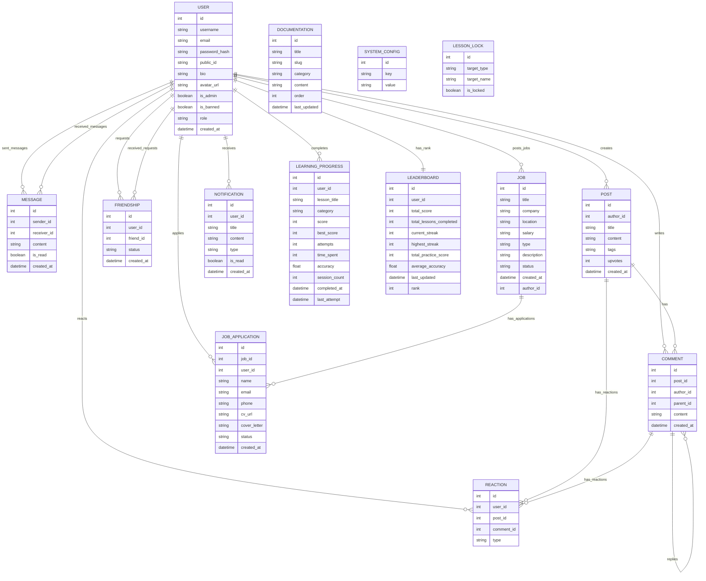

# 06. Database Documentation

Hệ thống AMP sử dụng **SQLite** ở môi trường phát triển cục bộ và tương thích hoàn toàn với **Turso/libsql** ở môi trường production thông qua adapter Prisma.

## Sơ đồ Thực thể Quan hệ (ERD)

## Các Bảng dữ liệu quan trọng

### 1. Bảng `user`
Lưu trữ thông tin tài khoản người dùng của hệ thống bao gồm phân quyền và trạng thái hoạt động.
- `public_id`: ID công khai dạng số ngẫu nhiên 6 chữ số dùng để ẩn danh tính thật khi giao tiếp xã hội và kết bạn.
- `role`: Phân cấp vai trò người dùng (`user`, `business`, `admin`).
- `is_banned`: Đánh dấu trạng thái tài khoản bị khóa bởi quản trị viên.

### 2. Bảng `learning_progress` & `leaderboard`
- `learning_progress`: Lưu chi tiết các nỗ lực học tập của người dùng, số điểm đạt được (`score`), điểm số cao nhất (`best_score`), tổng số lần thử (`attempts`) và độ chính xác trung bình (`accuracy`).
- `leaderboard`: Điểm tổng hợp được tính toán định kỳ hoặc sau mỗi bài học thành công để xếp hạng (`rank`) người học dựa trên tổng số điểm tích lũy (`total_score`).

### 3. Bảng `friendship`
- Thiết lập mối quan hệ bạn bè giữa hai đối tượng `user_id` and `friend_id`.
- Trạng thái kết bạn có các giá trị: `pending` (đang chờ), `accepted` (đã đồng ý).
