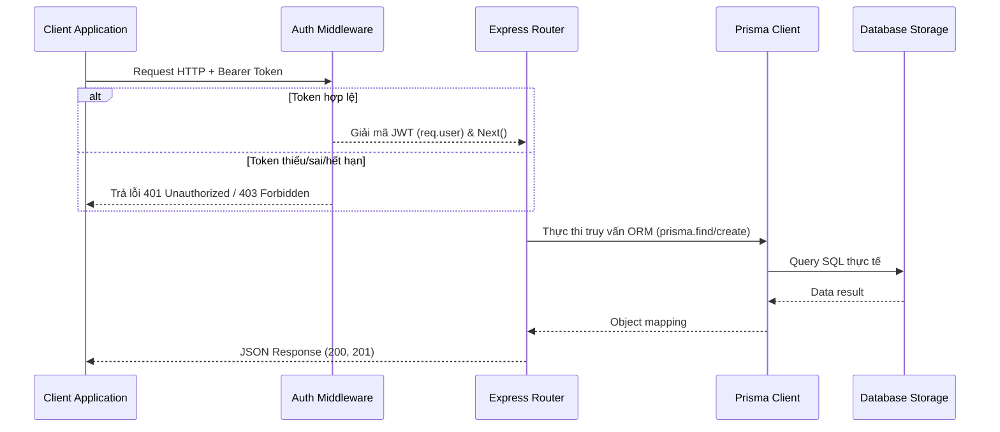

# Backend Implementation

Phân tích sâu cấu trúc xây dựng mã nguồn Backend của dự án AMP đặt tại thư mục [`source/backend`](file:///D:/Project/AMPV2/source/backend).

## Sơ đồ luồng xử lý Backend



## Các thành phần cấu tạo chính

### 1. Cơ chế Khởi tạo cơ sở dữ liệu linh hoạt (`server.js`)
Backend của AMP hỗ trợ hai loại Driver DB thông qua kiểm tra tiền tố kết nối:
- Nếu chuỗi `DATABASE_URL` bắt đầu bằng `libsql://` hoặc `http://`, máy chủ sẽ tự động kích hoạt Client của `@libsql/client` kết nối tới đám mây Turso, chuyển tiếp qua Prisma adapter:
  ```javascript
  const libsql = createClient({ url: connectionString, authToken: authToken });
  const adapter = new PrismaLibSQL(libsql);
  prisma = new PrismaClient({ adapter });
  ```
- Nếu không, máy chủ khởi tạo Prisma Client mặc định để kết nối trực tiếp với file SQLite cục bộ `dev.db`.

### 2. Định tuyến & Middleware
- ExpressJS Router chia nhỏ mã nguồn thành các module độc lập.
- Biến instance `prisma` được gắn trực tiếp vào Express App thông qua `app.set('prisma', prisma)` giúp các route file dễ dàng truy xuất thông qua `req.app.get('prisma')` mà không cần khởi tạo lại kết nối nhiều lần.
- Sử dụng thư viện `multer` cấu hình lưu trữ tạm thời tại thư mục `/uploads` để xử lý tải tệp tin của người dùng.
