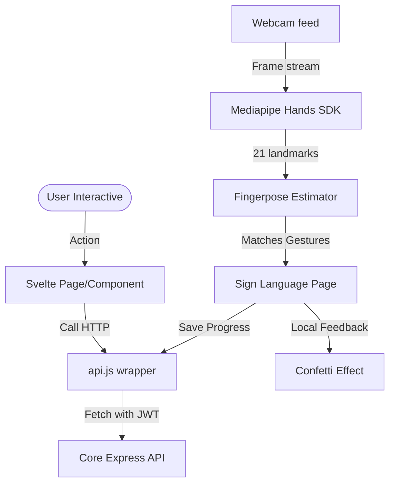

# Frontend Architecture & Edge AI

Phân tích mã nguồn SvelteKit Client tại thư mục [`source/frontend/amp`](file:///D:/Project/AMPV2/source/frontend/amp).

## Luồng luân chuyển dữ liệu của Client App

## Các thành phần cấu tạo chính

### 1. SvelteKit & Svelte 5 Runes
Mã nguồn frontend sử dụng phiên bản Svelte 5 mới nhất với các Runes thay thế cho cơ chế reactive cũ:
- `$state`: Quản lý trạng thái cục bộ (ví dụ: danh sách bài học, dữ liệu chat).
- `$effect`: Xử lý logic phụ thuộc (side-effects) như khởi tạo camera hoặc lắng nghe sự kiện từ socket.
- `$derived`: Tự động tính toán lại các thuộc tính dẫn xuất.

### 2. Tương tác Real-time (Socket.io)
- Kết nối tới backend thông qua SDK Socket.io được nạp trực tiếp qua CDN trong `app.html`.
- Đồng bộ hóa trạng thái tin nhắn tức thời và phát đi tín hiệu cập nhật tin nhắn chưa đọc (`unread-count`) cho thanh điều hướng chính.

### 3. Edge AI Engine (Nhận dạng cử chỉ tay)
- Luồng camera từ thẻ `<video>` được phân tích ở tần số quét cao qua thư viện **Mediapipe Hands** được nhúng trực tiếp.
- Tọa độ các khớp xương tay sau khi được phát hiện sẽ được đưa qua bộ kiểm thử **Fingerpose** để xác định độ uốn cong, hướng di chuyển của các ngón tay và đối sánh với mô hình ký tự được định nghĩa sẵn trong [`gestures.js`](file:///D:/Project/AMPV2/source/frontend/amp/src/lib/gestures.js).
- Điểm số chính xác và kết quả trùng khớp được hiển thị tức thì trên canvas của trình duyệt người dùng mà không cần gửi dữ liệu hình ảnh về server, đảm bảo tính bảo mật và tiết kiệm tài nguyên mạng.
