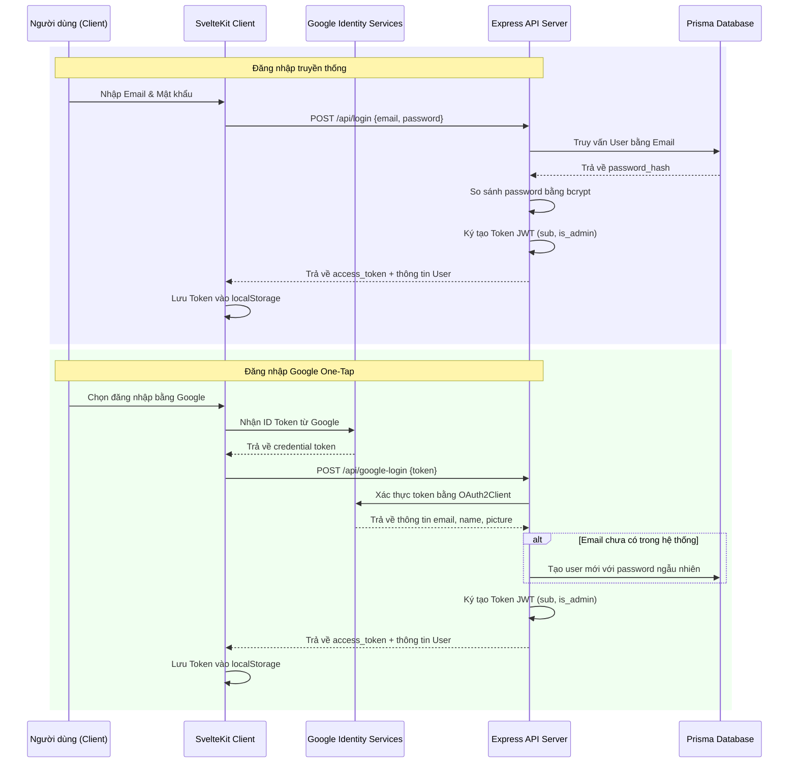

# 10. Authentication

Hệ thống AMP xây dựng cơ chế xác thực kép: Xác thực truyền thống qua Email/Mật khẩu được mã hóa và xác thực không mật khẩu thông qua Google One-Tap.

## Sơ đồ Quy trình Xác thực (Authentication Workflow)

## Giải pháp triển khai chi tiết

### 1. Phân quyền người dùng (Role & Permission)
Hệ thống quản lý quyền truy cập của người dùng dựa trên trường `role` trong cơ sở dữ liệu và thuộc tính `is_admin` được đóng gói bên trong JWT payload.
- `user`: Người dùng thông thường, có quyền tham gia diễn đàn, bình luận, kết bạn, nhắn tin và học tập.
- `business`: Doanh nghiệp tuyển dụng, được phép đăng tuyển công việc mới và xét duyệt hồ sơ ứng viên gửi đến.
- `admin`: Quản trị viên hệ thống, có quyền tối cao truy cập dashboard thống kê, ban/unban người dùng, phê duyệt bài viết/công việc và khóa/mở khóa các chương trình học tập cử chỉ tay.

### 2. Xác thực Middleware
Bộ lọc `authenticateToken` giải mã Token từ Header `Authorization: Bearer <token>` để gán thông tin định danh vào `req.user`. Nếu không có token hoặc token hết hạn, yêu cầu sẽ lập tiếp bị chặn với mã trạng thái `401 Unauthorized` hoặc `403 Forbidden`.
- Mã nguồn chi tiết nằm tại: [`auth.js` Middleware](file:///D:/Project/AMPV2/source/backend/middleware/auth.js).
