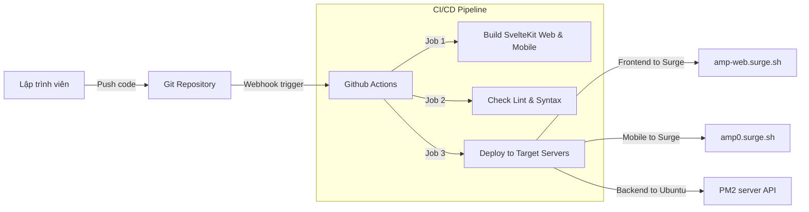
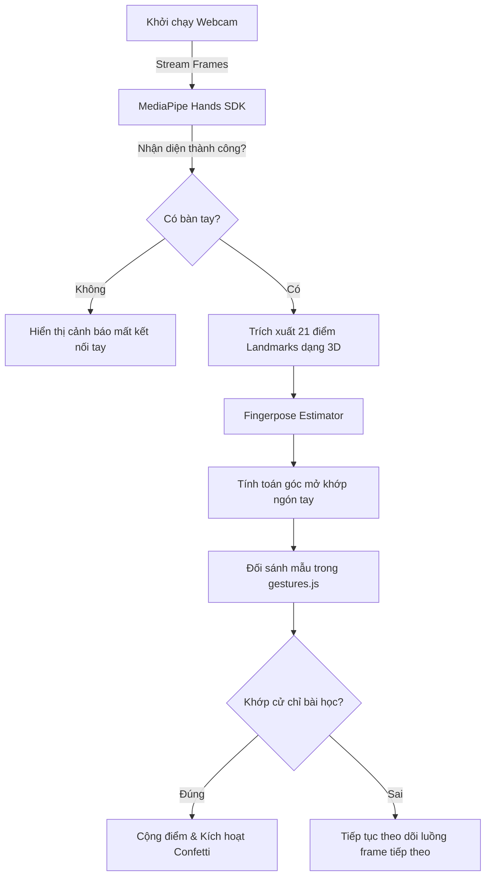
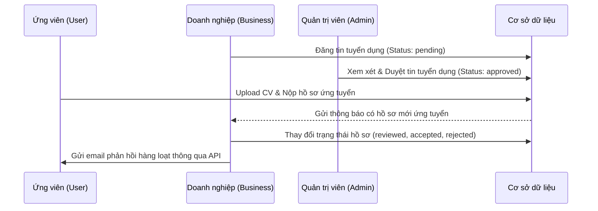

# 11. Core Workflows

Hệ thống AMP vận hành thông qua các quy trình nghiệp vụ cốt lõi dưới đây, bao gồm cả luồng phát triển phần mềm và các quy trình chức năng ứng dụng thực tế.

## 1. Quy trình Phát triển & Triển khai (Developer Workflow)

Sơ đồ mô tả luồng kiểm soát từ máy phát triển cục bộ tới khi mã nguồn được triển khai trên môi trường Production.

---

## 2. Quy trình Nhận dạng Cử chỉ tay học Ngôn ngữ Ký hiệu (AI Learning Workflow)

Sơ đồ mô tả cách thức hệ thống AI biên trên trình duyệt phân tích hình ảnh camera của người học.

---

## 3. Quy trình Tuyển dụng & Ứng tuyển (Recruitment Workflow)

Quy trình nộp đơn của người khuyết tật vào các doanh nghiệp xã hội liên kết.

