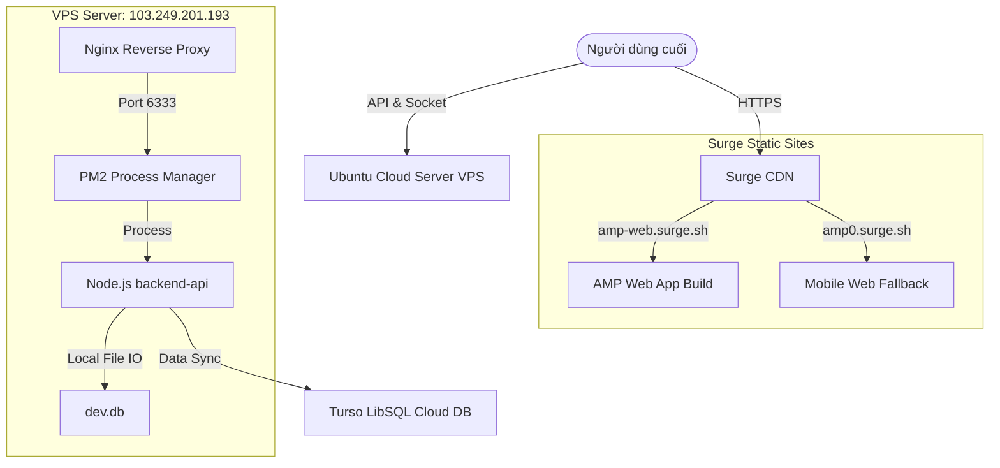

# 12. Deployment

Hệ thống AMP áp dụng mô hình phân tách deployment: Frontend phân tán toàn cầu qua CDN và Backend chạy tập trung trên máy chủ đám mây riêng VPS.

## Sơ đồ Kiến trúc Triển khai (Deployment Architecture)

## Các Môi trường Triển khai

### 1. Frontend Web (Surge)
*   **Địa chỉ Web**: `https://amp-web.surge.sh`
*   **Cơ chế hoạt động**: Mã nguồn SvelteKit được build ra các file tĩnh HTML/JS thông qua Adapter Static (`@sveltejs/adapter-static`). Khi đẩy lên Surge, tệp `index.html`/`404.html` được sao chép thành `200.html` để hỗ trợ cơ chế định tuyến Client-side Routing Fallback (Single Page Application).

### 2. Frontend Mobile App (Android APK)
*   **Build Tool**: Android SDK & Gradle.
*   **Cơ chế**: Capacitor đồng bộ mã nguồn web đã biên dịch vào thư mục `android/` và sử dụng Gradle Task (`./gradlew assembleDebug`) để build thành tệp `app-debug.apk` cài đặt trực tiếp trên thiết bị Android.

### 3. Backend (Ubuntu VPS Server)
*   **Địa chỉ IP**: `103.249.201.193`
*   **Cơ chế quản lý tiến trình**: Sử dụng **PM2** để chạy ngầm tiến trình Node.js dưới tên `backend-api` trên cổng `6333`. Khởi tạo Prisma tự động chạy các tệp lệnh sinh mã Client (`npx prisma generate`) trước khi khởi động lại ứng dụng.
