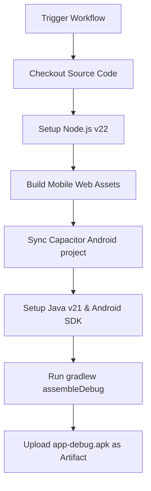

# 13. CI/CD Pipelines

Mọi quy trình kiểm thử, đóng gói và triển khai của AMP đều được tự động hóa hoàn toàn thông qua Github Actions. Cấu hình chi tiết nằm tại thư mục [`.github/workflows`](file:///D:/Project/AMPV2/.github/workflows).

## Các Pipelines tự động hóa

### 1. Build Android APK (`build-apk.yml`)
Kịch bản tự động build file cài đặt di động khi được kích hoạt thủ công (`workflow_dispatch`).



- **Lệnh thực thi chính**:
  ```bash
  cd source/frontend/mobile
  npm install
  npm run build
  npx cap sync android
  cd android
  chmod +x gradlew
  ./gradlew assembleDebug
  ```

---

### 2. Triển khai Web lên Surge (`deploy-surge.yml`)
Tự động đóng gói ứng dụng SvelteKit Web và Mobile Web rồi đẩy lên dịch vụ lưu trữ Surge CDN.
- **Dịch vụ 1 (Mobile Web)**: Deploy lên domain `amp0.surge.sh`.
- **Dịch vụ 2 (AMP Web)**: Deploy lên domain `amp-web.surge.sh`.
- **Các bước chuẩn bị đặc biệt cho Surge**:
  - Sao chép tệp `build/index.html` hoặc `build/404.html` thành `build/200.html` để đảm bảo cơ chế định tuyến (router) của SvelteKit không bị lỗi 404 khi người dùng tải lại trang trên trình duyệt.

---

### 3. Triển khai API Core lên máy chủ Ubuntu (`deploy-backend.yml`)
Kịch bản đồng bộ mã nguồn Backend lên máy chủ VPS qua kết nối bảo mật SSH/SCP.
1. **Sao chép tệp (Copy via SCP)**:
   Sử dụng hành động `appleboy/scp-action` để tải thư mục mã nguồn `source/backend/*` lên máy chủ tại đường dẫn `/var/www/AMPV2/source/backend`.
2. **Khởi chạy từ xa (Restart via SSH)**:
   Sử dụng hành động `appleboy/ssh-action` để thực thi chuỗi lệnh sau trực tiếp trên VPS:
   ```bash
   cd /var/www/AMPV2/source/backend
   npm install --legacy-peer-deps
   npx prisma generate
   npx pm2 restart backend-api || npx pm2 start server.js --name backend-api
   ```
